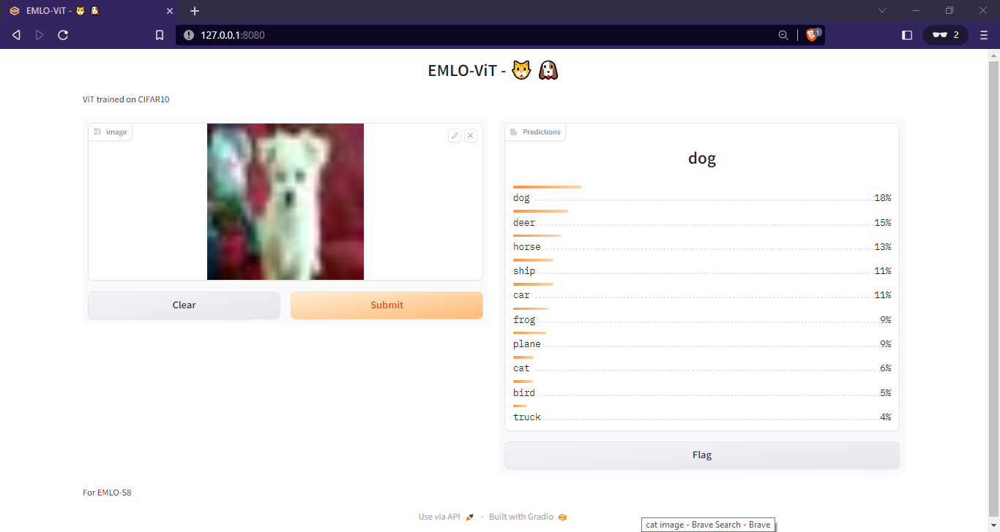
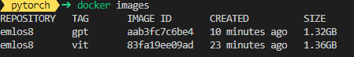

<div align="center">

# Session 8

</div>


## Introduction

In this session, we will script/trace models in TorchScript. This will be done for ViT as well as GPT (bonus). Then, we will load these scripted/traced models in a Gradio application and serve them (locally). Then it will be packaged into a docker image.


**Installation**  
```
pip install -r requirements.txt --user && pip install -e . --user 
```


## ViT Model

First, we train the model..

```
dlearn_train experiment=s8
```

```
best_ckpt=$(ls -td -- ./outputs/train/runs/* | head -n 1)'/best.ckpt'
python scripts/convert_pt_vit.py experiment=s8_convert_vit ckpt_path=$best_ckpt
```


Then, to launch the demo:

```
dlearn_demo_vit ckpt_path=outputs/model_vit.script.pt
```

This has been packaged into a docker container (inside the `docker` directory)

```
docker build -t emlos8:vit -f Dockerfile-vit .
```
To run the container, use the following command

```
docker run -it --rm -p 8080:8080 emlos8:vit
```



# Bonus Part - GPT

To script/trace the model, we will instantiate the model with the tuned hyperparameters, load the best checkpoint from last week's run, and perform conversion using...

```python
python scripts/convert_pt_gpt.py experiment=s8_convert_gpt ckpt_path=./outputs/best_gpt.ckpt
```

Then, we can load the UI via

```
dlearn_demo_gpt ckpt_path=outputs/model_gpt.trace.pt
```


This has been packaged into a docker container (inside the `docker` directory)
```
docker build -t emlos8:gpt -f Dockerfile-gpt .
```

To run the container, use the following command

```
docker run -it --rm -p 8080:8080 emlos8:gpt
```  


**Docker Image Size**  

